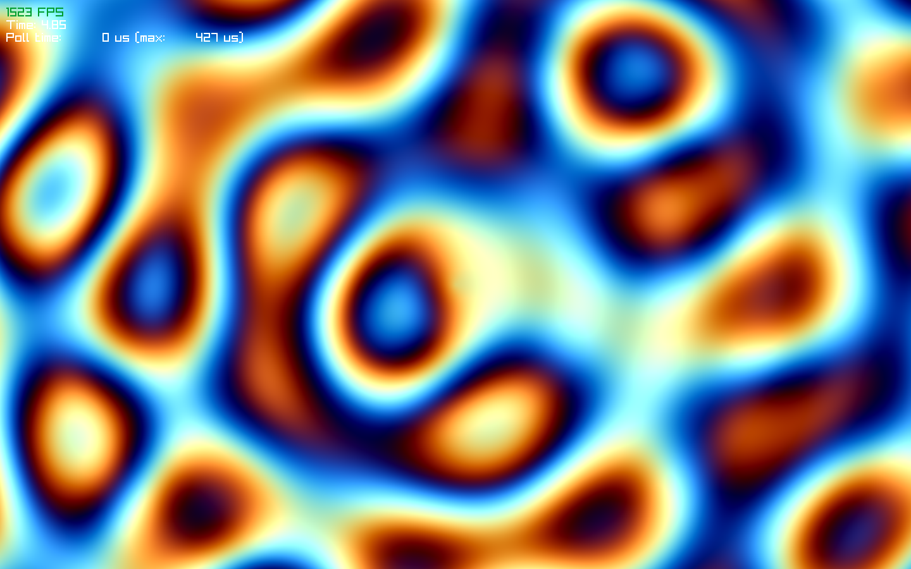

# SimpleCompute

OpenGL compute shader library for real-time graphics.



## Build & Run

```bash
make all    # Build shared library
make run    # Run example
```

## Example

```glsl
#version 430
layout(local_size_x = 1024, local_size_y = 1, local_size_z = 1) in;
layout(std430, binding = 0) buffer Data {
    float colors[];
};
uniform float time;

float plasma(vec2 uv) {
    vec2 p = uv * 8.0;
    float wave1 = sin(p.x + time * 2.0);
    float wave2 = sin(p.y + time * 1.5);
    float wave3 = sin((p.x + p.y) * 0.7 + time * 3.0);
    float wave4 = sin(sqrt(p.x * p.x + p.y * p.y) + time * 2.5);
    return (wave1 + wave2 + wave3 + wave4) * 0.25;
}

vec3 palette(float t) {
    vec3 a = vec3(0.5, 0.5, 0.5);
    vec3 b = vec3(0.5, 0.5, 0.5);
    vec3 c = vec3(1.0, 1.0, 1.0);
    vec3 d = vec3(0.263, 0.416, 0.557);
    return a + b * cos(6.28318 * (c * t + d));
}

void main() {
    uint idx = gl_GlobalInvocationID.x;
    uint width = 1440;
    uint height = 900;
    uint total_pixels = width * height;
    
    if (idx >= total_pixels) return;
    
    uint x = idx % width;
    uint y = idx / width;
    
    vec2 uv = vec2(x, y) / vec2(width, height);
    uv = uv * 2.0 - 1.0;
    uv.x *= float(width) / float(height);
    
    float plasma_value = plasma(uv);
    vec3 color = palette(plasma_value + time * 0.5);
    
    float dist = length(uv);
    float ripple = sin(dist * 20.0 - time * 8.0) * 0.1;
    color += ripple;
    
    colors[idx * 4 + 0] = color.r;
    colors[idx * 4 + 1] = color.g;
    colors[idx * 4 + 2] = color.b;
    colors[idx * 4 + 3] = 1.0;
}
```

## Usage

```c
ComputeShader shader = load_compute_shader(cs_source);
ComputeBuffer buffer = create_compute_buffer(data, size);
compute_dispatch(&shader, buffer);
```
